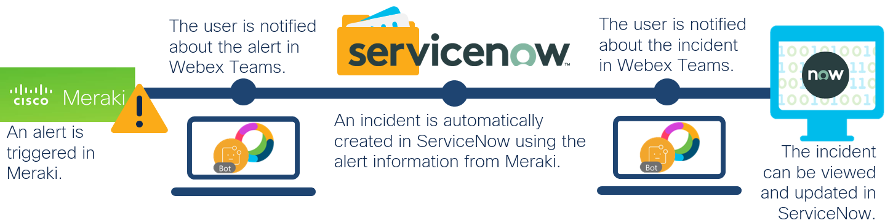
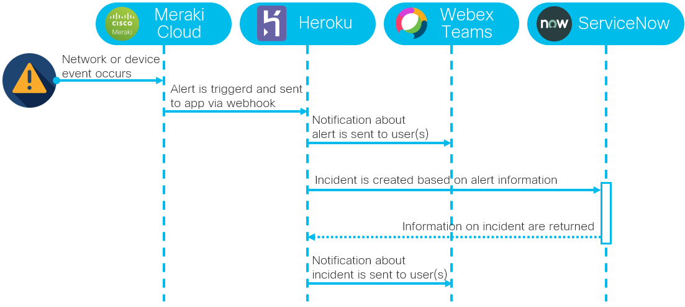

# Meraki ServiceNow Integration

A Flask application to automatically create incidents in ServiceNow following an alert in Meraki, and using a Webex Teams bot to update users about the process ([watch demo](https://youtu.be/lp-p_fjjToI)).


## Overview
 


**Alerts in Meraki**: Meraki allows alerts to be sent when certain network or device events occur. The settings for when an alert is triggered and where to send it can be changed directly in the Meraki dashboard. For this solution, a webhook is configured that subscribes to alerts sent from Meraki. The alert itself includes a JSON formatted message that is sent to a unique URL where it is processed further.

**Incidents in ServiceNow**: ServiceNow is an ITSM solution that amongst others includes major incident management capabilities. It enables IT teams to monitor and collaborate on issues more efficiently for faster remediation. By using the information from a Meraki alert to automatically create an incident in the ITSM solution, the process is further optimized as adding it into the system no longer involves manual work and occurs as soon as the issue is known to Meraki and the alert sent. The incident being created using this script includes a unique incident number, the Caller value associated with the ServiceNow credentials provided, impact and urgency metrics based on which the incident priority is calculated, the category set to *Network*, a short description with the Meraki alert ID and alert type, and a description including the full Meraki alert log for detailed information. 

**Webex Teams Notifier Bot**: To keep track of alerts in Meraki and incidents created in ServiceNow, a Webex Teams notifier bot is implemented to update users about the process. For each network or device event that occurs and that triggers a Meraki alert, the bot sends 2 notifications into a Webex Teams space created for that purpose. One notification informs users about the alert and that a ServiceNow incident is being created. Once that process is done, a second notification is sent, incl. the incident number and a direct link to the incident on ServiceNow where more information can be viewed and changes can be made. 
 
**Heroku**: The application is hosted on Heroku, a cloud platform as a service. The URL to the application is used by Meraki as webhook receiver to send alerts to. This is also where the alert log is further processed, the Webex Teams notifier bot triggered, and the ServiceNow incident creation started. As an alternative, the app can also run on the local machine together with ngrok (see installation instructions [using ngrok](#using-ngrok) instead of Heroku).

### Sequence Diagram:



## Contacts
* Jara Osterfeld (josterfe@cisco.com)
* Monica Acosta (moacosta@cisco.com)


## Solution Components
* Meraki 
* Webex Teams
* ServiceNow
* Heroku
* Flask
* Python


## Prerequisites
- **Meraki**: 
   - **Dashboard Access**: If you do not have access to a Meraki Dashboard, you can use a [Meraki sandbox](https://devnetsandbox.cisco.com/RM/Topology).
   - **Alert Settings**:
     1. Log in to the Meraki dashboard with your credentials and choose an organization and network.
     2. Go to **Network-wide > Configure > Alerts**.
     3. Configure the alerts for which you want to automatically create ServiceNow incidents in the **Alerts Settings** section following the [Alerts and Notifications documentation](https://documentation.meraki.com/zGeneral_Administration/Cross-Platform_Content/Alerts_and_Notifications).
     4. On the same page at the bottom, configure the webhook as HTTPS server in the **Webhooks** section following the [Webhook Setup and Configuration documentation](https://developer.cisco.com/meraki/webhooks/#!introduction/setup-and-configuration). The URL should point to the receiver, i.e. the application on Heroku (`https://<app-name>.herokuapp.com/`). Also set a shared secret and remember it. Then add the webhook as **Default recipient** at the top of the page. Hit **Save** at the bottom of the page. 


- **Webex Teams**: 
   - **Account**: If you do not have a Webex Teams account yet, you can create one [here](https://cart.webex.com/sign-up-webex) for free.
   - **Notifier Bot**:
     1. Go to the [Webex Developer website to create a bot](https://developer.webex.com/docs/bots).
     2. Log in with your Webex credentials by clicking **Log in** on the top right corner .
     3. Click **Create a Bot**.
     4. Fill in the information for your new bot, and click **Add Bot** at the bottom of the page.
     5. On the next page, you will see your **Bot Access Token**. Copy the token and save it as it will not be shown again.
   - **Dedicated Team Space**:
     1. Create a Webex Teams Space to which the bot should send alert and incident notifications by following [these instructions](https://help.webex.com/en-us/hk71r4/Webex-Teams-Create-a-Space).
     2. Name the space.
     3. Add the notifier bot that you created to the space. Also add other users that should receive the bot notifications.
     4. Click **Create**.
     5. Go to the [Webex API documentation for Webex Teams Rooms](https://developer.webex.com/docs/api/v1/rooms/list-rooms) to retrieve the ID.
     6. Use the interactive API endpoint on the right of the page. Use your personal access token (enabled by default) and if you just created the space, you can use the query parameter *sortBy* with the value *created* to list that space as the first entry in the response. Click **Run** and note the *id* value for the space you just created from the returned response.


- **ServiceNow**: If you do not have a ServiceNow setup, you can sign up for free for the [Developer Program](https://signon.service-now.com/ssoregister.do?redirectUri=https://servicenowsignon.okta.com/app/template_saml_2_0/k317zlfESMUHAFZFXMVB/sso/saml), which will provide you with a ServiceNow developer instance to play with.


- **Heroku** (not required if ngrok is used):
  - **Account**: If you do not have a Heroku account yet, [click here](https://signup.heroku.com/dc) to sign up for free.
  - **CLI and Git**: For the Heroku installation process outlined [below](#using-heroku), download the Heroku CLI [here](https://devcenter.heroku.com/articles/heroku-cli#download-and-install). Make sure to also have [Git](https://git-scm.com/book/en/v2/Getting-Started-Installing-Git) installed. 


## Installation

### Using Heroku

1. Clone this repository with `git clone <this repo>` and navigate to the directory with `cd <directory/to/repo>`.

2. Create an app on Heroku using the CLI and including the Python buildpack: 
   ```
   heroku create <app-name> --buildpack heroku/python
   ```
   - Make sure to have completed **step iv** of the **Meraki - Alerts Settings** [prerequisite](#prerequisites) with the same `<app-name>` in the URL as provided here. The correct URL is also shown in the terminal once the command above is run.  

4. Set the following environment variables: 
   ```
   heroku config:set WT_BOT_TOKEN=<bot token> WT_ROOM_ID=<Webex Teams room ID> MERAKI_SHARED_SECRET=<shared secret> SERVICENOW_INSTANCE=https://<your instance>.service-now.com SERVICENOW_USERNAME=<username> SERVICENOW_PASSWORD=<password> SERVICENOW_INCIDENT_DEFAULT_IMPACT=<integer> SERVICENOW_INCIDENT_DEFAULT_URGENCY=<integer>
   ```
   - The values of the variables *SERVICENOW_INCIDENT_DEFAULT_IMPACT* and *SERVICENOW_INCIDENT_DEFAULT_URGENCY* will determine the priority to which every ServiceNow incident is set by default. This follows the [incident priority table of ServiceNow](https://docs.servicenow.com/bundle/helsinki-it-service-management/page/product/incident-management/reference/r_PrioritizationOfIncidents.html).

5. Create a Heroku remote:
   ```
   heroku git:remote -a <app-name>
   ```

6. Deploy the code to Heroku: 
   ```
   git push heroku master
   ```

#### Alternatives Steps
- Step 2 and 3 can also be performed using the [Heroku dashboard](https://dashboard.heroku.com/apps). After being logged in, on the top right corner, click **New > Create new app**. On the next page, provide an app name and choose a region, and click **Create app**. By navigating to the **Settings** tab on the top of the next page, you can find the **Config Vars** and **Buildpacks** sections, where you can add environment variables and add the required buildpack. 
- Alternatively to step 5, the code can also be deployed to Heroku by connecting the app to [Github](https://devcenter.heroku.com/articles/github-integration) or by using [Docker](https://devcenter.heroku.com/categories/deploying-with-docker). Please find detailed instructions in the provided links or by navigating to the **Deploy** tab of the app on the [Heroku dashboard](https://dashboard.heroku.com/apps). 


### Using ngrok
Instead of using the Heroku PaaS to host the application, the code can also run on your local machine together with ngrok. ngrok opens a secure tunnel between your machine and the Internet, which is then mapped against a publicly reachable URL. This URL is used to send the webhooks with the Meraki alerts to and to securely process them on your machine.

Follow these steps to set the application up using ngrok: 

1. Setup the app: 
    1. Clone this repository with `git clone <this repo>` and navigate to the directory with `cd <directory/to/repo>`. 
    2. Create a Python virtual environment and activate it (find instructions [here](https://docs.python.org/3/tutorial/venv.html)).
    3. Install the requirements with `pip install -r requirements.txt`.
    4. Set the following environment variables: 
       ```
       set WT_BOT_TOKEN = <bot token>
       set WT_ROOM_ID = <Webex Teams room ID>
       set MERAKI_SHARED_SECRET = <shared secret>
       set SERVICENOW_INSTANCE = https://<your instance>.service-now.com
       set SERVICENOW_USERNAME = <username>
       set SERVICENOW_PASSWORD = <password>
       set SERVICENOW_INCIDENT_DEFAULT_IMPACT = <integer>
       set SERVICENOW_INCIDENT_DEFAULT_URGENCY = <integer>
       set FLASK_APP=botapp.py
       ```  
    5. Start the Flask app in the terminal with `flask run -p <port>`.
2. Setup ngrok: 
    1. If not installed yet, download ngrok [here](https://ngrok.com/download).
    2. Open a second terminal. 
    3. Navigate to the directory in which the ngrok application is installed.
    3. Start ngrok with `ngrok http <port>` (NB: port number must match the port number used with the `flask run -p <port>` command).
    4. From the following ngrok console UI, copy the public https address (https://xxx.ngrok.io).
    5. Complete **step iv** of the **Meraki - Alerts Settings** [prerequisite](#prerequisites). Instead of using the URL pointing to the application on Heroku, now use the public ngrok URL (https://xxx.ngrok.io and end it with a '/', i.e. https://xxx.ngrok.io/). 
       - Set the shared secret to the same value as the value of the MERAKI_SHARED_SECRET environment variable configured before. 
       - Remember to add the webhook as **Default recipient** at the top of the page, and to hit **Save** at the bottom of the page.


## License
Provided under Cisco Sample Code License, for details see [LICENSE](./LICENSE).


## Code of Conduct
Our code of conduct is available [here](./CODE_OF_CONDUCT.md).


## Contributing
See our contributing guidelines [here](./CONTRIBUTING.md).